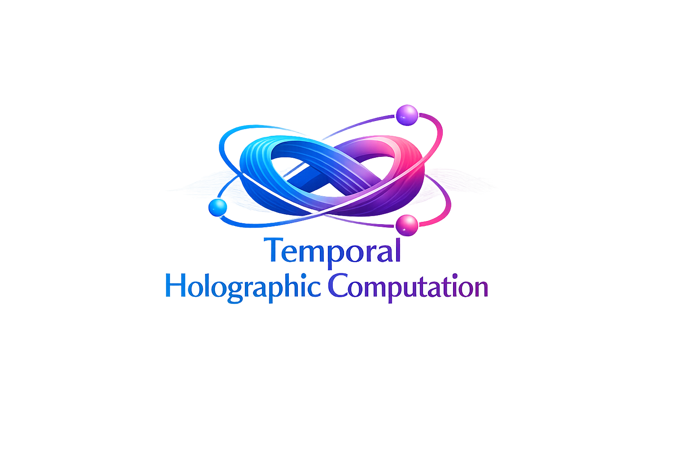

# Temporal Holographic Computing (THC)

## A Temporal-Relational Computational Architecture with Discrete Holographic State

**Developed by: Vasile Lucian Borbeleac with the assistance of ChatGPT-5.2 and Claude Opus 4.6**

---

## Abstract

We introduce Temporal Holographic Computing (THC), a computational architecture designed as a runtime substrate for artificial intelligence models, rather than a model itself. THC separates state evolution, temporal memory access, and relational computation into distinct, explicitly controlled mechanisms. The system employs a deterministic dynamical core coupled with holographic vector operations and multi-instant readout, enabling robust temporal-relational computation (e.g., multi-lag XOR >98% accuracy) while enforcing a bounded linear memory capacity. This boundedness acts as a structural constraint against uncontrolled state amplification and hallucination.

---

## 1. Conceptual Positioning

THC does not belong to conventional classes of:

- recurrent neural networks (RNN, LSTM, GRU),
- Echo State Networks (ESN),
- or symbolic AI systems.

Instead, THC defines a **computational substrate** characterized by:

- A deterministic, continuous-time-inspired state evolution,
- Explicit temporal storage via a bounded delay ring,
- Algebraic holographic operators for relational computation,
- Linear or multi-head readout trained via regression.

**Learning occurs only at the readout level.** The internal dynamics are fixed, stable, and non-adaptive.

---

## 2. System Architecture Overview

At each discrete time step *t*, the system maintains a state:

```
psi_t in R^(P x D)
```

where:

- **P** is the number of spatial units ("pins"),
- **D** is the internal dimensionality per pin (fixed, typically D = 16).

The flattened state dimension is N = P * D.

The system consists of five logically distinct layers:

1. **Input Injection Layer**
2. **Dynamical Evolution Core**
3. **Energy Regulation and Mixing**
4. **Temporal Storage (Delay Ring)**
5. **Holographic Readout and Binding Layer**

---

## 3. Input Injection

The external scalar input u_t in R is injected linearly:

```
psi_t <- psi_t + g * W_in * u_t
```

where:

- **W_in** in R^(P*D) is a fixed random projection,
- **g** is a global input gain.

This operation preserves input identity prior to any nonlinear dynamics.

---

## 4. Dynamical Evolution Core

State evolution is governed by a bounded second-order update inspired by leapfrog integration:

```
psi_{t+1} = psi_t + dt * v_t
v_{t+1}   = v_t   + dt * F(psi_t, psi_{t-tau})
```

with force term:

```
F(psi_t, psi_{t-tau}) = tanh(k * psi_t) - psi_t - a * tanh(psi_{t-tau})
```

where:

- **tau** is a fixed delay,
- **k** and **a** are stability parameters.

**All nonlinearities are bounded. No unbounded growth is possible.**

---

## 5. Leak and Energy Regulation

After dynamical evolution, a leaky integrator is applied:

```
psi_t <- (1 - lambda) * psi_t
```

with lambda in (0, 1).

This term is the primary control of memory horizon. Empirically, it governs the transition from short-lived dynamics to extended fading memory.

---

## 6. Non-Destructive Mixing

To prevent spatial decoupling without inducing diffusion, THC applies global but non-averaging mixing using coprime permutations with signed contributions:

```
psi_t <- (1 - beta) * psi_t + (beta / K) * sum_{i=1}^{K} s_i * Pi_i(psi_t)
```

where:

- **Pi_i** are long-orbit permutations,
- **s_i** in {+1, -1},
- variance is explicitly renormalized.

This preserves fine-grained structure while preventing collapse or synchronization.

---

## 7. Temporal Storage: Delay Ring

THC maintains a bounded temporal buffer:

```
R = { psi_{t-1}, psi_{t-2}, ..., psi_{t-tau} }
```

This ring is **not part of the dynamics**. It is a passive memory structure enabling explicit access to past states.

Crucially, experimental results show:

- **Identity information survives dynamics,**
- The apparent low memory capacity in single-snapshot readout is a measurement artifact,
- Multi-tap readout recovers linear memory capacity up to the delay horizon.

---

## 8. Holographic Binding and Relational Computation

THC implements Holographic Reduced Representation (HRR) via circular convolution:

```
bind(x, y)[d] = sum_{m=0}^{D-1} x[m] * y[(d - m) mod D]
```

Applied temporally:

```
B_l(t) = bind(psi_t, psi_{t-l})
```

This operation encodes **multiplicative temporal relations** such as:

```
u_t * u_{t-l}
```

As a result, THC achieves near-perfect performance on temporal XOR tasks across multiple lags -- capabilities unattainable by ESNs with linear readout.

---

## 9. Readout and Learning

The readout consists of one or more linear heads:

```
y_t = W_out * Phi(psi_t, R, B)
```

where Phi concatenates:

- current state psi_t,
- selected delay taps,
- holographic binding channels.

**Training uses ridge regression only. No backpropagation through time is employed.**

---

## 10. Empirical Properties

### Demonstrated Characteristics

| Property | THC | ESN (Reference) |
|----------|-----|-----------------|
| Linear Memory Capacity (with taps) | ~19 | ~44 |
| Nonlinear Memory Capacity (degree 2) | ~1.0 | 0 |
| Temporal XOR | >98% accuracy (matched lags) | ~49% (chance) |
| Stability | bounded energy, no divergence | -- |
| Hallucination resistance | enforced by bounded memory horizon | -- |

---

## 11. Interpretation and Design Implications

The observed memory ceiling is **not a defect**, but a structural property:

- THC prioritizes **relational temporal computation** over raw storage,
- Information must be present in input to be recalled,
- The system cannot self-amplify indefinitely.

This makes THC suitable as a computational substrate for higher-level AI models that require:

- temporal reasoning,
- causal structure,
- controlled generalization,
- resistance to runaway internal state.

---

## 12. Patent-Relevant Novelty Claims (Non-Exhaustive)

1. Separation of deterministic dynamics from temporal memory access.
2. Multi-instant readout of a single evolving state.
3. Temporal holographic binding as a first-class computational operator.
4. Bounded-memory architecture preventing uncontrolled recurrence.
5. Use of delay-ring-assisted readout without altering internal dynamics.

---

## 13. Intended Use

THC is intended to serve as:

- a **runtime platform** for temporal AI models,
- a **computational backend** for holographic and relational AI,
- a **controllable alternative** to large recurrent or attention-based systems.

It is not a drop-in neural network, but a **computational environment** in which models execute.

---

**Document Status**: v1.0
**Date**: 2026-02-09
**Author**: Vasile Lucian Borbeleac
**Architecture**: THC v3.0
